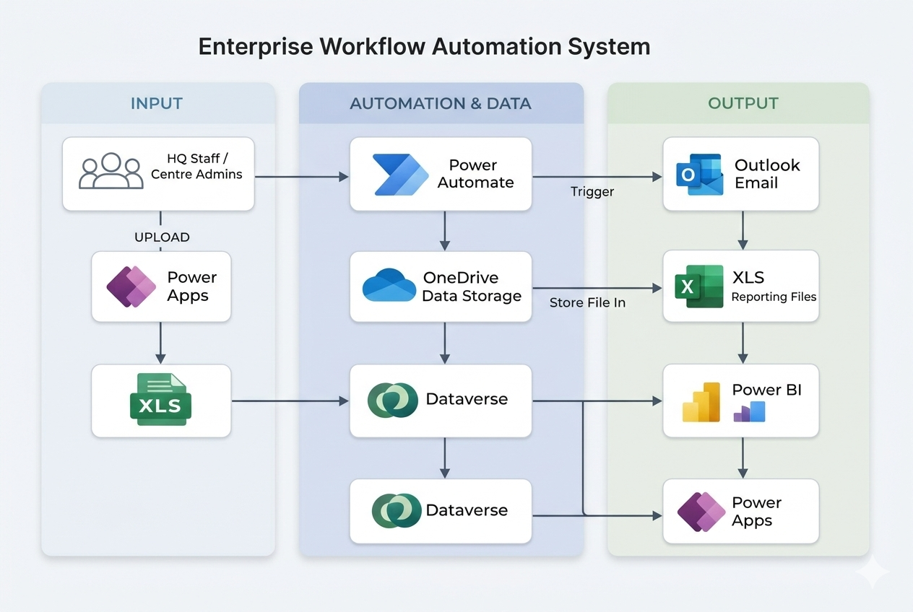
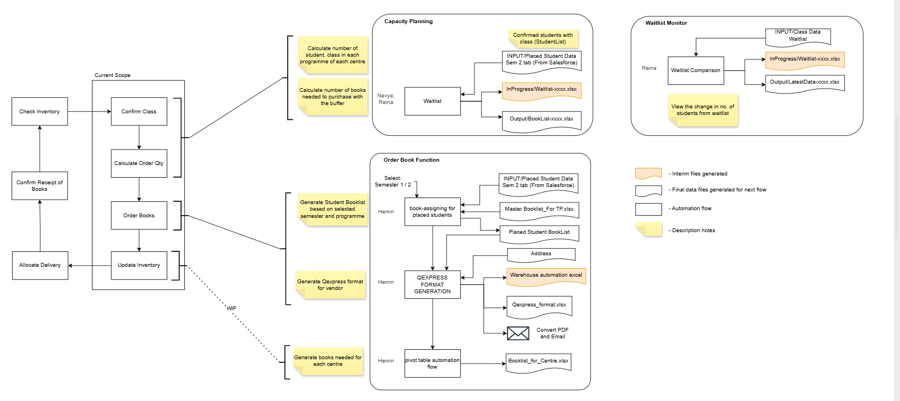

# Enterprise Education Resource Automation System (ERAS)

## Overview

The Enterprise Education Resource Automation System (ERAS) is a low-code workflow automation platform designed to streamline education resource planning across multiple operational centres and headquarters.

Developed over a structured 5-month development cycle in collaboration with an external educational support organisation in Singapore, this system replaces fragmented spreadsheet-based processes with structured automation, centralised data management, and real-time reporting.

---

## Business Challenge

Operational processes previously relied on multiple Excel files maintained independently by different centres. This resulted in:

- Manual spreadsheet consolidation  
- High risk of data inconsistency and duplication
- Complex book requirement calculations  
- Delays in allocation and order generation  
- Limited visibility into enrolment and inventory planning  

As enrolment volumes increased, the need for structured automation and centralised coordination became critical.

---

## Project Lifecycle (5-Month Development Phases)

### Phase 1 – Requirement Analysis
- Studied existing spreadsheet workflows
- Identified bottlenecks in consolidation and reporting
- Defined automation scope and system boundaries

### Phase 2 – System Architecture Design
- Designed a three-layer enterprise architecture
- Planned structured Dataverse schema
- Defined modular automation workflow separation

### Phase 3 – Automation Development
- Implemented Power Automate workflows
- Built rule-based book ordering and allocation logic
- Designed structured input validation processes

### Phase 4 – Reporting & Dashboard Development
- Designed Power BI dashboards for monitoring and planning
- Implemented programme-level and centre-level aggregation views
- Developed operational KPIs for decision support

### Phase 5 – Testing & Refinement
- Conducted iterative testing on automation logic
- Refined calculation rules and buffer mechanisms
- Validated workflow performance under increasing data volumes

---

## System Architecture

The ERAS platform follows a modular three-layer enterprise architecture model designed to separate input validation, automation logic, and reporting outputs. Those are:

### 1. Input Layer
- Power Apps frontend for authorised users  
- Structured Excel file uploads (Waitlist & Placement data)  
- Template validation and input standardisation  

### 2. Automation & Data Layer
- Power Automate workflows triggered upon file upload  
- Microsoft Dataverse as a centralised structured data repository  
- Enrolment comparison logic  
- Aggregation and allocation rules  
- Configurable buffer-based calculation logic  

### 3. Output & Reporting Layer
- Supplier-compatible purchase order generation  
- Automated Outlook email notifications  
- Power BI dashboards for operational monitoring and analytics

---

## Core Automation Workflows

### 1. Waitlist Comparison Workflow
- Compares latest and historical enrolment datasets  
- Detects newly formed classes  
- Identifies new student entries  
- Stores structured delta records in Dataverse  

### 2. Book Ordering Calculation Workflow
- Aggregates confirmed placement data  
- Computes class and student counts per programme  
- Applies subject-level and semester-based calculation rules  
- Incorporates configurable buffer quantities  
- Generates projected book requirement outputs  

### 3. Book Allocation & Purchase Order Workflow
- Allocates books to centres based on enrolment demand  
- Aggregates totals by subject and academic level  
- Transforms outputs into supplier-compatible purchase order format  
- Automatically triggers supplier notification workflows via Outlook integration.

---

## Dashboard Design & Analytics Layer

The reporting layer was designed to provide structured operational visibility across the entire automation pipeline. Dashboards were built using Power BI and connected to Dataverse as the central data source.

### 1. Waitlist Monitoring Dashboard

Purpose:
- Track total waitlisted students (current vs previous dataset)
- Identify newly formed classes
- Detect newly added or updated student records

Key Metrics:
- Total waitlisted (current)
- Number of new classes formed
- Number of new or updated student records
- Centre-level breakdown of waitlist changes

This dashboard enables early detection of enrolment growth trends and supports proactive capacity planning adjustments.
---

### 2. Capacity & Planning Dashboard

Purpose:
- Monitor student distribution across programmes
- Compare placement availability against required allocations
- Validate buffer-adjusted projections

Key Metrics:
- Total students per programme
- Total classes per programme
- Placement availability
- Total books needed (before and after buffer)
- Books to order (final adjusted value)

This dashboard enables data-driven planning before purchase orders are generated.

---

### 3. Book Allocation & Ordering Dashboard

Purpose:
- Provide aggregated view of book requirements across centres
- Validate supplier order quantities
- Ensure allocation consistency across academic levels

Key Metrics:
- Total books required
- Total books allocated to centres
- Total general buffer quantity
- Final books to order
- Subject-level and centre-level breakdown

This layer ensures order validation before automated email notifications are triggered.

---

## Technology Stack

- Microsoft Power Apps  
- Microsoft Power Automate  
- Microsoft Dataverse  
- Microsoft Power BI  
- Excel Automation  
- Outlook Integration  

---

## Technical Competencies Demonstrated

- Enterprise workflow automation design  
- Modular system architecture planning  
- Low-code application development  
- Structured relational data modelling using Dataverse  
- Rule-based automation logic implementation  
- Cross-platform system integration (Application → Automation → Reporting)  
- Business process optimisation  
- Data validation and traceability design
  
---

## My Role & Contributions

- Designed the three-layer system architecture model  
- Implemented automation workflows using Power Automate  
- Developed rule-based book calculation and allocation logic  
- Structured and defined Dataverse data relationships  
- Designed Power Apps user interface for structured file uploads and implemented conditional routing logic to trigger specific automation workflows.
- Conducted iterative testing, validation, and refinement across development phases

---

## Key Technical Challenges

- Handling multi-level data aggregations.
- Designing buffer-based allocation logic to prevent over-ordering while maintaining sufficient stock coverage  
- Comparing historical and latest enrolment datasets efficiently for accurate delta detection  
- Ensuring workflow modularity to prevent cross-dependency failures across automation stages  
- Maintaining data consistency and integrity throughout multiple workflow executions  
- Working within Power Automate platform limitations (execution time, row limits, and connector constraints)  
- Designing the system to operate without exposing confidential organisational data

## Impact

- Transformed fragmented spreadsheet-driven workflows into an integrated automation system  
- Reduced manual consolidation effort and minimised risk of calculation errors  
- Centralised operational data into a single structured data model using Dataverse  
- Enabled real-time monitoring of enrolment, allocation, and order validation metrics  
- Improved decision-making speed through dashboard-driven operational insights  
- Built a modular and scalable architecture capable of supporting increased data volumes and future system enhancements.
  
---

## Confidentiality Notice

This repository presents a sanitized portfolio case study version of the ERAS system developed in collaboration with an educational institution.
All organisation-specific details have been generalised.  
No confidential data, internal workflow exports, or proprietary configurations are included.
